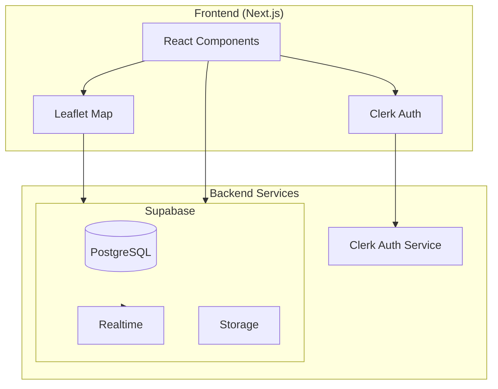

# Design Document: Flood Report System

## Overview

Sistem Pelaporan Banjir Real-time untuk Kota Malang adalah aplikasi web Next.js yang memungkinkan warga melaporkan dan memverifikasi kondisi banjir secara real-time. Sistem menggunakan Clerk untuk autentikasi, Supabase untuk database real-time, dan Leaflet.js untuk peta interaktif.

Fitur utama:
- Peta interaktif dengan color-coded markers berdasarkan ketinggian air
- Agregasi bukti dari media sosial (Instagram, Twitter/X, TikTok)
- Sistem kedaluwarsa laporan dengan konfirmasi "Masih Banjir"
- Fitur "Jalur Kering" untuk rute alternatif
- Dark mode UI dengan desain neobrutalist

## Architecture



### Data Flow

1. User authenticates via Clerk
2. User submits flood report with location + proof
3. Report saved to Supabase PostgreSQL
4. Supabase Realtime broadcasts to all clients
5. Map updates with new marker

## Components and Interfaces

### Frontend Components

```
app/
├── layout.tsx              # ClerkProvider wrapper, dark mode
├── page.tsx                # Main map view
├── components/
│   ├── Map/
│   │   ├── FloodMap.tsx        # Leaflet map container
│   │   ├── FloodMarker.tsx     # Individual flood marker
│   │   ├── DryRouteMarker.tsx  # Dry route marker
│   │   └── MarkerPopup.tsx     # Popup with details
│   ├── Report/
│   │   ├── ReportButton.tsx    # Large "LAPOR" button
│   │   ├── ReportForm.tsx      # Report submission form
│   │   ├── LocationPicker.tsx  # Pin drop component
│   │   └── ProofUpload.tsx     # Photo/social link input
│   ├── Filter/
│   │   └── QuickFilters.tsx    # Filter buttons
│   ├── Social/
│   │   └── SocialEmbed.tsx     # Instagram/Twitter/TikTok embed
│   └── Auth/
│       └── AuthHeader.tsx      # Sign in/out buttons
├── lib/
│   ├── supabase.ts             # Supabase client
│   ├── types.ts                # TypeScript types
│   ├── validators.ts           # URL & form validation
│   └── utils.ts                # Helper functions
└── hooks/
    ├── useReports.ts           # Real-time reports subscription
    └── useConfirmation.ts      # Confirmation logic
```

### Key Interfaces

```typescript
// lib/types.ts

export type WaterLevel = 'siaga' | 'bahaya' | 'evakuasi';
export type ReportType = 'flood' | 'dry_route';
export type SocialPlatform = 'instagram' | 'twitter' | 'tiktok';

export interface FloodReport {
  id: string;
  user_id: string;
  type: ReportType;
  latitude: number;
  longitude: number;
  water_level: WaterLevel | null; // null for dry routes
  photo_url: string | null;
  social_url: string | null;
  social_platform: SocialPlatform | null;
  confirmation_count: number;
  created_at: string;
  last_confirmed_at: string;
  expires_at: string;
}

export interface ReportConfirmation {
  id: string;
  report_id: string;
  user_id: string;
  confirmed_at: string;
}

export interface ReportFormData {
  type: ReportType;
  latitude: number;
  longitude: number;
  water_level: WaterLevel | null;
  photo: File | null;
  social_url: string | null;
}

export interface SocialUrlParseResult {
  platform: SocialPlatform;
  contentId: string;
  embedUrl: string;
}

export type FilterType = 'all' | 'passable' | 'blocked' | 'dry';
```

### Validation Functions

```typescript
// lib/validators.ts

export function validateSocialUrl(url: string): SocialUrlParseResult | null;
export function isInstagramUrl(url: string): boolean;
export function isTwitterUrl(url: string): boolean;
export function isTikTokUrl(url: string): boolean;
export function extractSocialContentId(url: string, platform: SocialPlatform): string | null;
export function validateReportForm(data: ReportFormData): ValidationResult;
```

### Utility Functions

```typescript
// lib/utils.ts

export function getMarkerColor(waterLevel: WaterLevel): string;
export function getMarkerOpacity(report: FloodReport): number;
export function isReportExpired(report: FloodReport): boolean;
export function filterReports(reports: FloodReport[], filter: FilterType): FloodReport[];
export function serializeReport(report: FloodReport): string;
export function deserializeReport(json: string): FloodReport;
```

## Data Models

### Supabase Database Schema

```sql
-- Enable UUID extension
CREATE EXTENSION IF NOT EXISTS "uuid-ossp";

-- Flood Reports Table
CREATE TABLE flood_reports (
  id UUID PRIMARY KEY DEFAULT uuid_generate_v4(),
  user_id TEXT NOT NULL,
  type TEXT NOT NULL CHECK (type IN ('flood', 'dry_route')),
  latitude DECIMAL(10, 8) NOT NULL,
  longitude DECIMAL(11, 8) NOT NULL,
  water_level TEXT CHECK (water_level IN ('siaga', 'bahaya', 'evakuasi') OR water_level IS NULL),
  photo_url TEXT,
  social_url TEXT,
  social_platform TEXT CHECK (social_platform IN ('instagram', 'twitter', 'tiktok') OR social_platform IS NULL),
  confirmation_count INTEGER DEFAULT 0,
  created_at TIMESTAMPTZ DEFAULT NOW(),
  last_confirmed_at TIMESTAMPTZ DEFAULT NOW(),
  expires_at TIMESTAMPTZ DEFAULT (NOW() + INTERVAL '3 hours'),
  
  CONSTRAINT valid_flood_report CHECK (
    (type = 'flood' AND water_level IS NOT NULL) OR
    (type = 'dry_route' AND water_level IS NULL)
  ),
  CONSTRAINT has_proof CHECK (photo_url IS NOT NULL OR social_url IS NOT NULL)
);

-- Report Confirmations Table
CREATE TABLE report_confirmations (
  id UUID PRIMARY KEY DEFAULT uuid_generate_v4(),
  report_id UUID NOT NULL REFERENCES flood_reports(id) ON DELETE CASCADE,
  user_id TEXT NOT NULL,
  confirmed_at TIMESTAMPTZ DEFAULT NOW(),
  
  UNIQUE(report_id, user_id, confirmed_at)
);

-- Indexes for performance
CREATE INDEX idx_reports_expires_at ON flood_reports(expires_at);
CREATE INDEX idx_reports_type ON flood_reports(type);
CREATE INDEX idx_reports_water_level ON flood_reports(water_level);
CREATE INDEX idx_confirmations_report_id ON report_confirmations(report_id);
CREATE INDEX idx_confirmations_user_id ON report_confirmations(user_id);

-- Enable Row Level Security
ALTER TABLE flood_reports ENABLE ROW LEVEL SECURITY;
ALTER TABLE report_confirmations ENABLE ROW LEVEL SECURITY;

-- RLS Policies
CREATE POLICY "Anyone can view reports" ON flood_reports
  FOR SELECT USING (true);

CREATE POLICY "Authenticated users can insert reports" ON flood_reports
  FOR INSERT WITH CHECK (auth.uid()::text = user_id);

CREATE POLICY "Anyone can view confirmations" ON report_confirmations
  FOR SELECT USING (true);

CREATE POLICY "Authenticated users can insert confirmations" ON report_confirmations
  FOR INSERT WITH CHECK (auth.uid()::text = user_id);

-- Enable Realtime
ALTER PUBLICATION supabase_realtime ADD TABLE flood_reports;
ALTER PUBLICATION supabase_realtime ADD TABLE report_confirmations;
```

## Correctness Properties

*A property is a characteristic or behavior that should hold true across all valid executions of a system-essentially, a formal statement about what the system should do. Properties serve as the bridge between human-readable specifications and machine-verifiable correctness guarantees.*

### Property 1: Report Serialization Round-Trip
*For any* valid FloodReport object, serializing to JSON and then deserializing should produce an equivalent object.
**Validates: Requirements 3.7, 3.8**

### Property 2: Water Level Color Mapping
*For any* water level value (siaga, bahaya, evakuasi), the getMarkerColor function should return the correct color (yellow, orange, red respectively).
**Validates: Requirements 2.2**

### Property 3: Report Expiry Detection
*For any* FloodReport, if the current time exceeds expires_at, isReportExpired should return true; otherwise false.
**Validates: Requirements 2.4**

### Property 4: Social URL Validation
*For any* URL string, validateSocialUrl should return a valid SocialUrlParseResult only if the URL matches Instagram, Twitter/X, or TikTok patterns; otherwise null.
**Validates: Requirements 4.1, 4.2, 4.3, 4.4, 4.5**

### Property 5: Report Form Validation
*For any* ReportFormData, validation should pass only if: location is set, water_level is set for flood type, and at least one proof (photo or social_url) is provided.
**Validates: Requirements 3.2, 3.3, 3.4**

### Property 6: Filter Correctness
*For any* array of FloodReports and filter type:
- 'passable' filter returns only reports with water_level='siaga'
- 'blocked' filter returns only reports with water_level='evakuasi'
- 'dry' filter returns only reports with type='dry_route'
- 'all' filter returns all active reports
**Validates: Requirements 7.1, 7.2, 7.3, 7.4**

### Property 7: Confirmation Increment
*For any* report confirmation action, the confirmation_count should increase by exactly 1 and expires_at should be reset to 3 hours from confirmation time.
**Validates: Requirements 5.2**

### Property 8: Duplicate Confirmation Prevention
*For any* user who has confirmed a report within the last hour, attempting to confirm again should be rejected.
**Validates: Requirements 5.4**

### Property 9: Marker Opacity Based on Freshness
*For any* FloodReport, getMarkerOpacity should return 1.0 if not expired and has recent confirmation; reduced opacity (0.5) if expired without confirmation.
**Validates: Requirements 2.4, 5.3**

### Property 10: Unauthenticated User Restrictions
*For any* unauthenticated user, report submission should be blocked while map viewing remains accessible.
**Validates: Requirements 1.3**

## Error Handling

### Client-Side Errors

| Error Type | Handling Strategy |
|------------|-------------------|
| Invalid social URL | Display inline error, prevent submission |
| Missing required fields | Highlight fields, show validation message |
| Location not selected | Prompt user to drop pin |
| Network error | Show toast notification, allow retry |
| Auth session expired | Redirect to sign-in |

### Server-Side Errors

| Error Type | Handling Strategy |
|------------|-------------------|
| Database constraint violation | Return 400 with specific error message |
| Duplicate confirmation | Return 409 Conflict |
| Unauthorized | Return 401, trigger re-auth |
| Rate limiting | Return 429, show cooldown message |

### Supabase Real-time Errors

- Connection lost: Auto-reconnect with exponential backoff
- Subscription error: Log error, fallback to polling

## Testing Strategy

### Property-Based Testing Library
**fast-check** akan digunakan untuk property-based testing di TypeScript/JavaScript.

### Unit Tests
- Test individual utility functions (getMarkerColor, isReportExpired, etc.)
- Test validation functions with specific examples
- Test component rendering with React Testing Library

### Property-Based Tests
Setiap correctness property akan diimplementasikan sebagai property-based test menggunakan fast-check:

```typescript
// Example structure
import fc from 'fast-check';

// Property 1: Report Serialization Round-Trip
test('serialization round-trip preserves report data', () => {
  fc.assert(
    fc.property(floodReportArbitrary, (report) => {
      const serialized = serializeReport(report);
      const deserialized = deserializeReport(serialized);
      return deepEqual(report, deserialized);
    })
  );
});
```

### Test Configuration
- Minimum 100 iterations per property test
- Each test tagged with format: `**Feature: flood-report-system, Property {number}: {property_text}**`

### Integration Tests
- Test Supabase real-time subscription
- Test Clerk authentication flow
- Test end-to-end report submission

### Test File Structure
```
__tests__/
├── unit/
│   ├── validators.test.ts
│   ├── utils.test.ts
│   └── components/
├── property/
│   ├── serialization.property.test.ts
│   ├── validation.property.test.ts
│   ├── filters.property.test.ts
│   └── confirmation.property.test.ts
└── integration/
    ├── supabase.test.ts
    └── auth.test.ts
```
